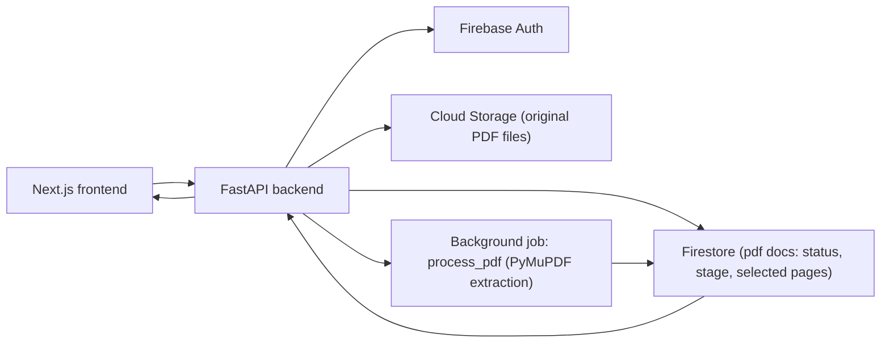
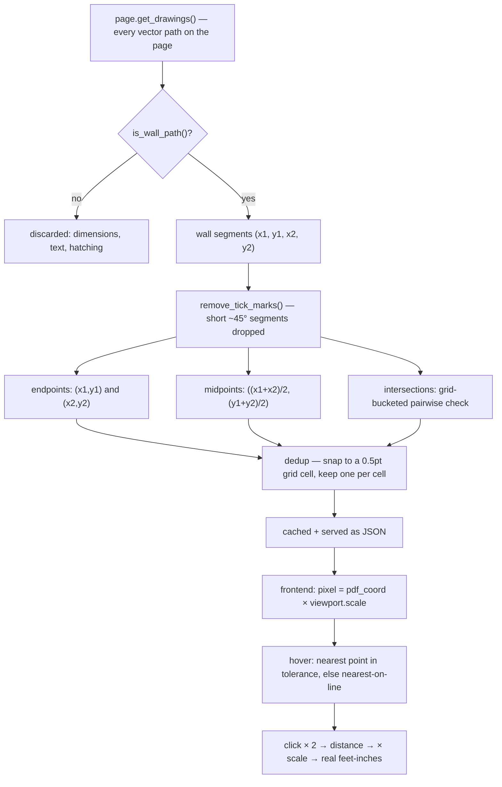
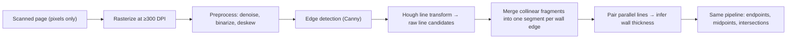

# Plan Measuring Tool

I built this to solve a pretty specific problem: I'd get an architectural PDF from a client and need to measure walls on it — real distances, not guesses. So this lets you upload a PDF, pulls out the actual wall geometry from it, and then you click points directly on the drawing to measure. The clicks snap precisely to walls — endpoints, midpoints, intersections, or anywhere along a wall line — so you're not eyeballing pixels.

## What I Built

| Area | Details |
|---|---|
| Auth | Email/password signup and login via Firebase Authentication, enforced on every API route |
| Upload | You pick which page thumbnails you actually want before uploading — only those pages ever get stored, processed, or served |
| Processing | A background job extracts wall geometry and computes snap points per page. It reports real stage/progress, not a fake loading bar |
| Viewer | Standard PDF viewer stuff: page nav, zoom, fit width/page, fullscreen, space-to-pan, Ctrl+scroll zoom |
| Measurement | Click-to-measure with snap-to-point (endpoint / midpoint / intersection / nearest-on-line), converted to real feet-inches using the sheet's printed scale |
| History | A per-user sidebar, grouped by upload recency, that shows live processing status |

## Architecture



The browser never talks to Firebase directly — only to the FastAPI routes, and those verify the caller's Firebase ID token on every single request.

## Security Model

| User | What they can do |
|---|---|
| Anonymous | Login/signup pages only |
| Logged-in user | Upload PDFs; view and measure only their own documents |
| Direct API caller | Every route requires a valid Firebase ID token. Asking for a page outside the uploader's selected set just returns 404 — not "unprocessed," a flat not-found |

Backend env you'll need (`backend/.env`, gitignored):

```env
TYPE=...
PROJECT_ID=...
PRIVATE_KEY_ID=...
PRIVATE_KEY=...
CLIENT_EMAIL=...
CLIENT_ID=...
AUTH_URI=...
TOKEN_URI=...
AUTH_PROVIDER_X509_CERT_URL=...
CLIENT_X509_CERT_URL=...
UNIVERSE_DOMAIN=...
STORAGE_BUCKET=...
FIREBASE_WEB_API_KEY=...
```

Frontend env (`frontend/.env.local`):

```env
NEXT_PUBLIC_API_URL=http://localhost:8000
```

## How Measuring Actually Works

The key thing that makes this work at all: the PDF is vector, not a scanned image. It contains the actual drawing commands that produced each wall — not a picture of one. That's the difference between coordinates that are exact and coordinates that are guessed.



**Filtering down to walls** (`wall_filter.py`) — I only count a path as a wall if it matches *all three* of these, based on this sheet's own Wall Types Legend:

- stroke color is black, or the specific gray used for partition walls
- stroke width is one of the exact line weights walls are drawn at on this sheet (`{0.36, 0.54, 0.72, 0.84, 1.02, 1.44, 1.68}` pt)
- the path's bounding box actually falls inside the floor-plan drawing region of the page (this excludes schedules, legends, and the title block sitting elsewhere on the sheet)

I want to be upfront that this is a per-document heuristic, not a general-purpose wall detector — see Limitations below. It's also optional at the code level, by design: `extract_segments(page, path_filter=None)` takes the filter as an optional argument, and returns every vector segment on the page if you don't pass one in. The wall filter is just the one filter I chose to always plug into the app's routes today — extraction itself doesn't require it.

**Computing the actual points** (`snap_points.py`):

- *Endpoint* — just the segment's own `(x1, y1)` and `(x2, y2)`. No computation needed.
- *Midpoint* — `((x1 + x2) / 2, (y1 + y2) / 2)`.
- *Intersection* — solve the standard two-segment parametric equation `P1 + t(P2 − P1) = P3 + u(P4 − P3)` for `t` and `u`. It only counts as a real intersection if both land in `[0, 1]` — meaning it's inside both actual segments, not their infinite extensions. Checking every pair across thousands of segments would be O(n²), so I bucket segments into a spatial grid first and only check pairs that share a cell.
- *Dedup* — several walls meeting at one corner produce a cluster of near-identical points. I snap each point to a 0.5pt grid cell and just keep the first one seen per cell.

### What the hover markers mean

| Marker | Color | Meaning |
|---|---|---|
| ▢ square | red | **Endpoint** — the exact end of a wall segment |
| △ triangle | blue | **Midpoint** — the center of a wall segment |
| ✕ cross | green | **Intersection** — where two wall segments cross |
| ○ circle | orange | **Nearest** — nothing fixed was close enough, so this is just the closest point on *any* wall line instead |

### Prior art (I didn't invent this approach)

This snap-first idea isn't novel — it's how existing takeoff/markup tools already handle measurement on vector PDFs:

- **Bluebeam Revu**'s Content Snap offers the same Nearest / Midpoint / Intersection snap types, and it explicitly requires vector data too — it falls back to manual polyline tracing on scanned PDFs, same limitation I have here — [Bluebeam Community: snap types in Revu](https://community.bluebeam.com/discussion/6903/what-happened-to-the-snaps-in-bluebeam-21-8)
- **PlanSwift**'s Snap tool locks the cursor onto existing points during takeoff the same way, though its snap only targets points already digitized in PlanSwift or imported CAD points — not raw PDF vector geometry the way this project and Bluebeam's Content Snap do — [ConstructConnect: Using Snap](https://help.constructconnect.com/03-a-detailed-look-at-the-home-tab-and-drawing-takeoff-and-annotations-176/using-snap-1494)

One trap I fell into and want to flag: PyMuPDF's coordinates are top-left-origin, y-down (matching the rendered image), while pdf.js's own coordinate helpers assume the opposite. Mixing the two silently mirrors every point vertically. The fix is just a plain scale multiply — no flip needed once you know which convention you're in.

### If the PDF were raster instead of vector

A scanned or photographed sheet has no drawing commands at all — `get_drawings()` comes back empty. Step 1 ("get segments") would have to become actual computer vision instead of a clean extraction. Everything after that step (filter → points → snap → measure → scale) stays the same:



What each of those new steps would actually be doing:

- **Rasterize + preprocess** — a photographed or scanned sheet is basically never perfectly flat or aligned, so deskewing and binarizing first is what makes edge detection usable at all.
- **Canny + Hough transform** — the classical way to turn "pixels that look like an edge" into actual line equations. Hough tends to over-segment one straight wall edge into several near-collinear fragments, so those need merging back into a single line afterward.
- **Wall thickness from parallel pairs** — vector extraction gets a wall's thickness for free, since it's just the stroke width in the drawing command. A raster scan only gives you two parallel lines with a gap between them, so thickness has to be inferred by detecting that pairing.
- **No scale metadata** — even a vector PDF still needs the user to pick the sheet's printed scale (as above), but a raster scan doesn't even have that text as selectable data. It'd need OCR on the printed scale note, or the user manually calibrating two points of known real-world distance by hand.

The pipeline downstream of "get segments" ends up identical either way. The real difference is the accuracy ceiling: vector extraction is exact by construction, while raster detection is only as good as scan resolution, skew, and how well the detector tells real wall edges apart from noise. It'd also be a meaningfully bigger engineering lift than the vector path I actually took here — think a maintained OpenCV pipeline, or a trained line/wall-detection model for messier scans, versus the handful of small filter/geometry functions vector extraction needed.

## How To Run

Backend:

```powershell
cd backend
python -m venv .venv
.\.venv\Scripts\Activate.ps1
pip install -r requirements.txt
uvicorn app.main:app --reload --port 8000
```

Frontend:

```powershell
cd frontend
bun install
bun run dev
```